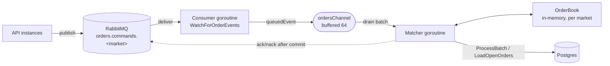

# Matching Engine — `core` Technical Reference

This folder documents how the `core` service turns a published order command into a
durable, settled match. It is the implementation-level companion to the higher-level
[`../ARCHITECTURE.md`](../ARCHITECTURE.md) (messaging topology).

## Contents

| Document | Covers |
|---|---|
| [order-lifecycle.md](order-lifecycle.md) | The full path of an order: queue → consumer → matcher → transaction → ack, the micro-batch loop, **ack-after-commit**, and **commit-failure recovery**. |
| [matching-and-settlement.md](matching-and-settlement.md) | Inside the book: price–time priority, order denominations, FOK pre-check, the order-status state machine, and the **balance reservation/settlement/release** math. |

## The one-paragraph version

The API publishes an order command to a per-market RabbitMQ queue and returns
`202 Accepted` — it never waits for the result. Each market has exactly one `core`
consumer that validates the command and hands it to that market's **single matcher
goroutine**. The matcher drains a micro-batch, and in **one Postgres transaction**:
reserves each order's funds, runs the in-memory match, and bulk-writes every
side-effect. Only after the transaction **commits** does it acknowledge the batch to
the broker. If the transaction fails, nothing is persisted, the in-memory book is
rebuilt from the database, and the messages are requeued for an idempotent retry.

## Component map

| Component | File | Responsibility | Goroutine |
|---|---|---|---|
| Consumer | [`order_events_queue.go`](../pkg/order_events_queue/order_events_queue.go) | Parse envelope, dead-letter malformed, forward `OrderDelivery` (ack/nack **deferred**). | Consumer |
| Classifier / dispatcher | [`order_processor.go`](../internal/orderprocessors/order_processor.go) → `handleDelivery` | Decode + validate, drop invalid, push to channel. | Consumer |
| Matcher | `order_processor.go` → `matcher` / `runBatch` | Drain batch, drive the transaction, ack/rebuild. | **Matcher (sole writer)** |
| Order book | [`orderbook.go`](../internal/orderbook/orderbook.go) | Pure in-memory matching; accumulates side-effects into a `BatchResult`. | Matcher only |
| Persistence | [`batch.go`](../../db/pkg/repository/batch.go) → `ProcessBatch` | Idempotency, reservation, bulk flush, commit. | Matcher (DB) |

> **Concurrency invariant.** The `OrderBook` is **not** thread-safe and is touched only
> by the matcher goroutine. The consumer goroutine never accesses it — it only parses,
> validates, and enqueues. This is why cancels are routed *through the channel* rather
> than applied directly by the consumer.
