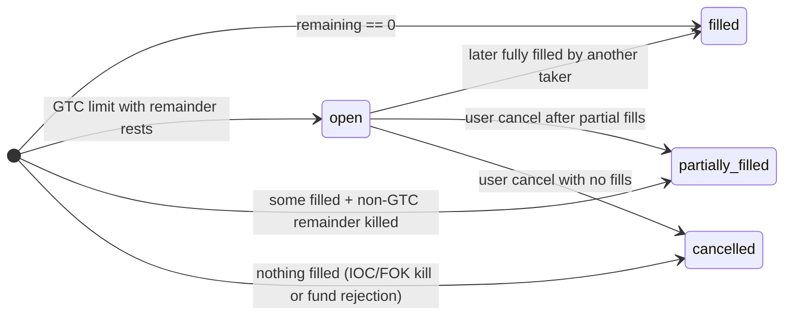
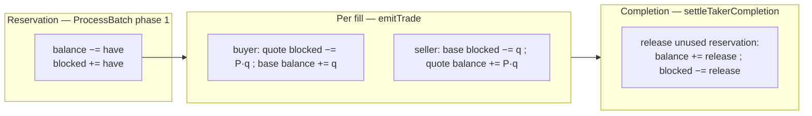

# Matching & Settlement Reference

This is the technical reference for the in-memory engine in
[`orderbook.go`](../internal/orderbook/orderbook.go): how it stores resting orders, how
it matches, and how funds move. The book is **pure** — it performs no I/O and instead
accumulates every persistent side-effect into a
[`BatchResult`](../../db/pkg/repository/batch.go) that the matcher flushes in one
transaction (see [order-lifecycle.md](order-lifecycle.md)).

- [1. Book structure](#1-book-structure)
- [2. Order denominations](#2-order-denominations)
- [3. The matching loop](#3-the-matching-loop)
- [4. Time-in-force](#4-time-in-force)
- [5. Order-status state machine](#5-order-status-state-machine)
- [6. Balance lifecycle: reserve → settle → release](#6-balance-lifecycle-reserve--settle--release)
- [7. Hydration](#7-hydration)

---

## 1. Book structure

```
OrderBook (one per market)
├── bids : BTreeG[*PriceLevel]   ordered by price ascending
├── asks : BTreeG[*PriceLevel]   ordered by price ascending
└── index: map[OrderID]orderLocator   O(1) lookup for cancel

PriceLevel
├── Price
├── Orders : container/list   FIFO, front = oldest
└── TotalQty                  Σ remaining (used by the FOK pre-check)
```

Both sides use the same ascending comparator. The "best" price is reached by walking the
*opposite* tree from the correct end:

| Taker side | Walks | Direction | Best opposite price first |
|---|---|---|---|
| Buy | `asks` | `Ascend` | lowest ask |
| Sell | `bids` | `Descend` | highest bid |

Within a price level, the `list` preserves **time priority** (oldest at the front). Price
priority (across levels) + time priority (within a level) = **price–time priority**.

> Empty levels are collected during traversal and deleted **after** it — mutating the
> B-tree inside `Ascend`/`Descend` is unsafe.

---

## 2. Order denominations

Most orders are **base-denominated** (`Remaining` counts base units). The exception is a
**market buy**, which is **quote-denominated**: it carries a spend budget
(`RemainingQuote`), not a target quantity. This is enforced upstream in
[`ValidateOrderEvent`](../pkg/order_events_queue/utils.go):

| Order | Denomination | `have` (reserved) amount |
|---|---|---|
| Limit buy | base (`Remaining`) | quote = `price × qty` |
| Limit sell | base (`Remaining`) | base = `qty` |
| **Market buy** | **quote (`RemainingQuote`)** | quote = `quote_qty` |
| Market sell | base (`Remaining`) | base = `qty` |

Why the asymmetry: the amount to block must be computable up front. A market **buy** by
base quantity has an unknown cost (no price), so it is rejected; it must use `quote_qty`.
A market **sell** by quote amount has an unknown base size, so it must use `quantity`.
This is also what makes the quote-denominated branch necessary — a market buy spends a
budget, it does not fill a quantity.

---

## 3. The matching loop

`MatchOrder` builds the taker, optionally runs the FOK pre-check, matches, then settles
and records the outcome:

```mermaid
flowchart TD
  NEW[newOrder&#40;event&#41;] --> G{guards ok?}
  G -- no --> DONE
  G -- yes --> F{FOK and cannot fully fill?}
  F -- yes --> DONE
  F -- no --> MATCH[match: walk opposite levels]
  MATCH --> DONE[settleTakerCompletion + emitTakerOutcome]
```



Inside `match`, for each crossing level, front-to-back:

```
qty = fillQty(taker, maker, price)        # base units tradable now
  base-denom taker:  min(taker.Remaining,        maker.Remaining)
  quote-denom taker: min(taker.RemainingQuote/price, maker.Remaining)
apply fill → emit trade (settlement + match row)
maker fully filled? → remove from level + index, status→filled
else                → update open_orders remaining
```

`crosses` decides whether a level is eligible: a market order crosses everything; a limit
buy crosses asks `≤ price`; a limit sell crosses bids `≥ price`. **Every fill executes at
the maker's resting price**, never the taker's — this is the price-improvement source
settled in [§6](#6-balance-lifecycle-reserve--settle--release).

---

## 4. Time-in-force

| TIF | Behaviour | Rests in `open_orders`? |
|---|---|---|
| GTC | Good-till-cancel; limit only. The only kind that rests. | Yes, if any remainder |
| IOC | Fill what crosses now, kill the rest. | No |
| FOK | Fill 100% immediately or kill untouched (pre-checked by `canFill`). | No |

`canFill` is the FOK gate: for a base order it sums opposite `TotalQty` across crossing
levels and checks it covers the quantity; for a quote-denominated market buy it sums
`price × TotalQty` and checks it covers the budget. A failing FOK never touches the book.

A market order never rests (a market GTC is rejected at validation).

---

## 5. Order-status state machine



Decided in `takerStatus` (taker) and `CancelOrder` (resting order):

- **filled** — fully matched (`Remaining == 0`, or budget spent for a market buy).
- **open** — a GTC limit order that rested with a remainder; partial progress lives in
  `open_orders.remaining_*`, not in the status.
- **partially_filled** — terminal: some volume traded but the remainder was killed
  (IOC/FOK/market remainder) or the order was cancelled after partial fills.
- **cancelled** — terminal: nothing traded (immediate kill, FOK failure, or insufficient
  funds at reservation).

> A hydrated order loses its original quantity (only the remainder is persisted), so a
> cancel after a restart reports `cancelled` even if it had partially filled before. This
> is a known, documented limitation.

---

## 6. Balance lifecycle: reserve → settle → release

A `user_balances` row has `balance` (available) and `blocked` (reserved). Funds move in
three steps that, together, conserve value — money is only ever transferred, never created.



**Reservation** (in the transaction, *before* matching — see order-lifecycle §4) blocks
the order's full `have` amount.

**Per fill**, at maker price `P` and base quantity `q` (`quoteAmt = P·q`):

| Party | base | quote |
|---|---|---|
| Buyer | `balance += q − buyerFee` | `blocked −= quoteAmt` |
| Seller | `blocked −= q` | `balance += quoteAmt − sellerFee` |

The buyer spends reserved quote and receives base; the seller gives up reserved base and
receives quote. A maker always trades at its own resting price, so its reservation is
consumed exactly. **Fees** are charged on the asset each party *receives*, at the taker
rate for the incoming order and the maker rate for the resting order
(`feeOf(amount, bps) = amount × bps / 10000`, floored). They are deducted from the
credit, recorded on the `matches` row (`match_buy_fees` in base, `match_sell_fees` in
quote), and otherwise leave the system — there is no house account. Fees do **not** touch
reservation or release: the buyer still pays the full `quoteAmt`, it just receives less
base. Rates come from the market (`taker_fee_bps` / `maker_fee_bps`, default 0).

**Completion release** (taker only) returns funds the taker reserved but will not use:

```
held    = reserve − spent           # buy: quote; sell: base still blocked after fills
keep    = rests ? (reservation backing the resting remainder) : 0
release = held − keep               # if > 0: balance += release, blocked −= release
```

This single rule covers every case:

- **Price improvement** — a buyer reserved at its limit but traded cheaper; the
  difference on the filled volume is released even when the order rests.
- **Unfilled remainder** — an IOC/market order that did not fully fill releases the rest.
- **Resting order** — keeps *exactly* the funds backing its remaining quantity blocked.

A **cancel** (`CancelOrder`) releases all still-blocked funds of the resting remainder.

Worked example (fees off) — limit buy 10 @ 120 hits a resting sell 10 @ 100:

```
reserve:        quote balance −1200, blocked +1200
fill (10 @100): buyer  quote blocked −1000, base balance +10
                seller base  blocked −10,    quote balance +1000
completion:     held = 1200 − 1000 = 200, rests=false, keep=0 → release 200
                buyer quote balance +200, blocked −200
net buyer:      quote −1000 total, base +10        (paid 1000, got 10)
net seller:     base  −10 total,   quote +1000     (gave 10, got 1000)
```

The conservation invariant — every instrument's `Σ(balance + blocked)` change equals
`−(fees collected in that instrument)` (zero when fees are off) — is asserted in
`orderbook_test.go`.

---

## 7. Hydration

On startup, and after a commit-failure rebuild, `Hydrate` reloads resting orders from
`open_orders` (via `LoadOpenOrders`) and reinserts them into the book. Rows arrive
ordered by `open_orders.id` (a `BIGSERIAL`), which reproduces insertion order and
therefore restores per-level FIFO priority. Base remaining is derived from the side
(`want` amount for a buy, `have` amount for a sell). See
[order-lifecycle.md §6](order-lifecycle.md#6-commit-failure-recovery) for how this fits
the recovery path.
