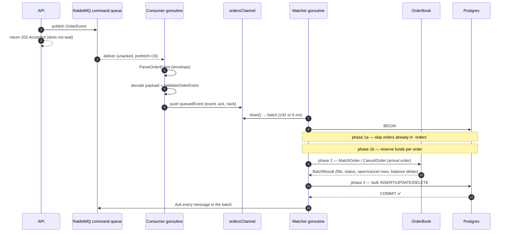
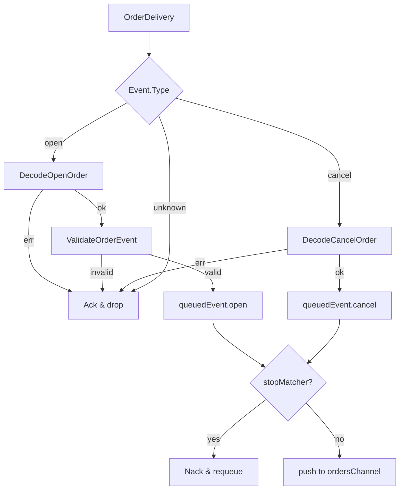
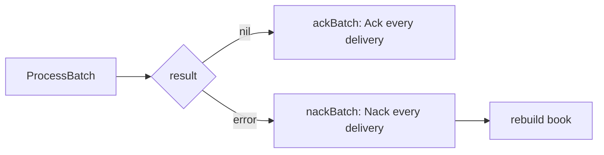

# Order Lifecycle — Queue to Acknowledgement

This document follows a single order command from the moment it is delivered by
RabbitMQ until the batch containing it is acknowledged, and then details what happens
when the database transaction fails.

- [1. End-to-end happy path](#1-end-to-end-happy-path)
- [2. The consumer: parse, validate, drop or forward](#2-the-consumer-parse-validate-drop-or-forward)
- [3. The micro-batch drain](#3-the-micro-batch-drain)
- [4. The transaction: `ProcessBatch`](#4-the-transaction-processbatch)
- [5. Ack-after-commit](#5-ack-after-commit)
- [6. Commit-failure recovery](#6-commit-failure-recovery)
- [7. Idempotency](#7-idempotency)
- [8. Ordering guarantees](#8-ordering-guarantees)
- [9. Shutdown](#9-shutdown)

---

## 1. End-to-end happy path



The defining property: **the API does not block on the match** (step 2). The client
learns the outcome later by polling `GET /orders/{id}` or via the event stream. This is
what makes ack-after-commit acceptable — the system is already asynchronous, so
discovering "rejected for insufficient funds" a few milliseconds later costs nothing.

---

## 2. The consumer: parse, validate, drop or forward

The consumer goroutine runs [`WatchForOrderEvents`](../pkg/order_events_queue/order_events_queue.go),
which drains the broker delivery channel **sequentially** (FIFO). For each delivery it
parses the envelope; a malformed envelope is **rejected without requeue** (dead-lettered)
because retrying a corrupt message is pointless. Everything else is wrapped in an
`OrderDelivery` — crucially, **without acknowledging** — and handed to the processor's
`handleDelivery`.

`handleDelivery` decodes and validates, then either drops or forwards:



Why a dropped message is **acked immediately** (not deferred to the batch): an invalid
or malformed message produces **no database effect**, so it is not part of any
transaction. Acking it on the spot prevents an infinite redelivery loop and keeps it out
of the matcher entirely. Only events that will actually be persisted ride the
ack-after-commit path.

> Validation happens on the consumer goroutine on purpose: it never touches the book, so
> it cannot race the matcher, and it keeps junk out of the batch.

---

## 3. The micro-batch drain

The matcher's `drain` blocks for the first event, then greedily collects more **without
blocking** until the batch reaches `maxBatchSize` (32) or `maxBatchWait` (5 ms) elapses:

```
drain():
  first ← <-ordersChannel        # block (no busy-wait); channel closed ⇒ matcher exits
  batch ← [first]
  loop until len(batch)==32:
    select:
      qe  ← <-ordersChannel  → append
      5ms timer fired        → return batch
```

A lone order in a quiet market is committed within ~5 ms of arrival; a busy market
amortises one `BEGIN/COMMIT` over up to 32 orders. In practice the batch is also bounded
by the broker **prefetch of 16** — at most 16 messages can be unacked/in-flight, so the
channel rarely holds more than that.

---

## 4. The transaction: `ProcessBatch`

[`ProcessBatch`](../../db/pkg/repository/batch.go) runs the whole batch as **one**
transaction in three phases. The matcher passes in the per-order reservations and a
`match` callback; `ProcessBatch` owns `BEGIN`/`COMMIT`.

```mermaid
flowchart TD
  BEGIN([BEGIN]) --> IDEM[phase 1a: existingOrderIDs]
  IDEM --> LOOP{for each incoming order}
  LOOP -- already in `orders` --> SKIP[skip: already processed]
  LOOP -- new --> RES[phase 1b: reserveBalance<br/>UPDATE ... WHERE balance ≥ amount]
  RES -- rowsAffected=1 --> FUND[add to fundedIDs]
  RES -- rowsAffected=0 --> REJ[appendRejection<br/>status=cancelled]
  RES -- DB error --> ERR[return error]
  FUND --> LOOP
  REJ --> LOOP
  SKIP --> LOOP
  LOOP -- done --> MATCH[phase 2: match&#40;fundedIDs&#41;<br/>mutates the book, builds BatchResult]
  MATCH --> FLUSH[phase 3: flushBatch<br/>bulk writes, FK-safe order]
  FLUSH --> COMMIT{COMMIT}
  COMMIT -- ok --> OK([nil → ack batch])
  COMMIT -- error --> ERR
  ERR --> ROLL([rollback → caller rebuilds])
```



Key points, phase by phase:

- **1a — idempotency.** Any order already present in `orders` was committed by a prior
  (possibly redelivered) batch. It is skipped entirely — not matched, not reserved, not
  persisted again. See [§7](#7-idempotency).
- **1b — reservation.** `reserveBalance` is an atomic conditional `UPDATE` moving the
  order's `have` amount from `balance` to `blocked`. `rowsAffected == 0` means
  insufficient funds → the order is **rejected** (recorded as `cancelled`) and excluded
  from matching. A reservation rejection is **not** an error; the transaction proceeds.
  The row lock taken here is held to commit, which serialises a user's shared-instrument
  balance (e.g. USDT) across markets.
- **2 — matching.** The `match` callback (defined in the matcher) replays the batch in
  arrival order, calling `MatchOrder` for funded opens and `CancelOrder` for cancels. It
  is pure in-memory work that **mutates the book** and returns a `BatchResult`.
- **3 — flush.** `flushBatch` writes the `BatchResult` with one statement per table, in
  FK-safe order (`orders` first, then `open_orders` / `cancelled_orders` / `matches`,
  then balance settlement).

The tables touched per batch:

| Table | Written by |
|---|---|
| `orders` | new orders (insert) + maker status transitions (update) |
| `open_orders` | GTC remainder rests (insert), partial maker (update), filled/cancelled (delete) |
| `cancelled_orders` | killed remainder / rejection / user cancel (insert) |
| `matches` | one row per fill (insert) |
| `user_balances` | reservation (phase 1) + settlement & release (phase 3) |

---

## 5. Ack-after-commit

The single most important rule: **a message is acknowledged only after the transaction
that persists it commits.**



Contrast with the alternative the codebase deliberately rejects — *acking on enqueue*
(the moment the consumer pushes to the channel). Under that model a commit failure would
lose the order: it is gone from the broker but never reached the database. Ack-after-commit
makes "accepted and persisted" a single atomic fact from the broker's perspective.

The cost is bounded by prefetch: at most 16 messages are unacked at once, so the broker
provides natural backpressure if the matcher stalls.

---

## 6. Commit-failure recovery

This is the scenario the design is built around. Look again at the transaction:
**phase 2 mutates the in-memory book, but the writes are only durable at `COMMIT`
(phase 3).** If the commit fails, Postgres rolls everything back — but there is no
rollback for RAM. The book now believes trades happened that the database never recorded.

```mermaid
flowchart TD
  C{COMMIT} -- fails --> RB1[Postgres rolls back<br/>DB = last committed state]
  RB1 --> DIRTY[In-memory book is DIRTY<br/>phase 2 already mutated it]
  DIRTY --> NACK[nackBatch → broker requeues the messages<br/>they were never acked]
  NACK --> LOAD[loadBook: discard book,<br/>NewOrderBook + Hydrate&#40;LoadOpenOrders&#41;]
  LOAD --> OK{load ok?}
  OK -- no, DB still down --> BO[backoff 2s] --> LOAD
  OK -- yes --> CLEAN[Book now matches committed DB state]
  CLEAN --> REDELIVER[Broker redelivers the requeued messages]
  REDELIVER --> REPROCESS[Reprocessed in a fresh batch]
  REPROCESS --> IDEM[Idempotency skips anything that did commit]
```



The recovery protocol, as implemented in `runBatch` + `loadBook`:

1. **Do not ack** — the messages were never acknowledged, so the broker still owns them.
2. **Nack/requeue** the batch.
3. **Discard and rebuild** the book from `open_orders` via `LoadOpenOrders` →
   `Hydrate`. Because the failed transaction rolled back, `open_orders` reflects the last
   consistent state. `loadBook` retries with backoff until the database returns (during
   an outage there is nothing useful to do but wait; the durable queue buffers).
4. The broker **redelivers**; the messages are reprocessed against the clean book.

```
runBatch:
  err ← ProcessBatch(...)
  if err:
      nackBatch(batch)        # requeue
      return loadBook(...)    # rebuild; false ⇒ shutdown requested
  ackBatch(batch)             # success
```

Failure taxonomy:

| Failure | Example | Handling |
|---|---|---|
| Transient infra | DB down, connection dropped | Rollback → nack → rebuild → retry; queue buffers, nothing lost. |
| Deadlock / serialization | two markets lock the same user's balance row in opposite order | Postgres aborts one; same rebuild-and-retry path. |
| Commit ambiguity | `COMMIT` succeeded but the ack of it was lost | DB *did* commit; on reprocess, idempotency skips the already-present orders. See [§7](#7-idempotency). |
| Poison message | an order that fails every commit | _Not yet handled_ — would currently requeue forever; the planned mitigation is one-order-per-tx isolation + dead-letter (see `TODO.md`). |

> **Why rebuild instead of undoing the book's mutations?** Rebuilding from the database
> is simple and obviously correct, and commit failures are exceptional. A copy-on-write
> overlay (mutate a diff, merge on commit, drop on failure) would avoid the rebuild but
> reimplements book mutation against a diff structure — deferred until commit failures or
> rebuild cost actually warrant it.

---

## 7. Idempotency

At-least-once delivery means the matcher can see the same order twice — after a
nack/requeue, or in the commit-ambiguous case where the data committed but the
acknowledgement was lost. The `orders` table is the authoritative "has this been
processed" ledger:

- **Phase 1a** queries `existingOrderIDs` and **skips** any order already present —
  skipped from *matching*, not merely from the insert. A redelivered, already-committed
  order therefore has no effect: it is not re-matched and its funds are not re-reserved.
- The `INSERT ... ON CONFLICT (id) DO NOTHING` on `orders` is a secondary backstop.

Order IDs are UUIDv7 generated by the API, so they are stable across redelivery — the
same command always carries the same key.

Cancels are idempotent by nature: `CancelOrder` is a no-op if the order is not in the
book (already filled, cancelled, or never resting).

---

## 8. Ordering guarantees

Strict price–time priority depends on strict FIFO, which holds at every hop:

- **One queue, one consumer per market** — no cross-order parallelism within a market.
- The consumer loop is **sequential** (`for delivery := range deliveries`).
- The channel preserves push order; `drain` collects in receive order.
- The `match` callback **replays the batch in arrival order**, interleaving opens and
  cancels, so a cancel that arrived before a later order is applied first.

Parallelism exists only *across* markets — each market has its own queue, consumer,
matcher, and book.

---

## 9. Shutdown

Shutdown is driven by cancelling the context passed to `Start`:

1. The context cancels → `WatchForOrderEvents` returns → `Start` closes `ordersChannel`.
2. The matcher's `drain` observes the closed channel and exits once drained.

The matcher uses `context.Background()` for its database work (not the cancelled context)
so an **in-flight batch can still commit** during shutdown. If the post-commit ack then
fails because the broker channel is already closing, the broker simply requeues those
messages; on the next start they are redelivered and skipped by idempotency
([§7](#7-idempotency)). Either way, no committed work is lost and nothing is double-applied.
