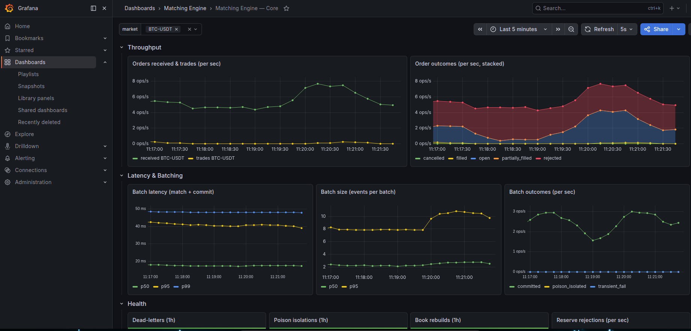
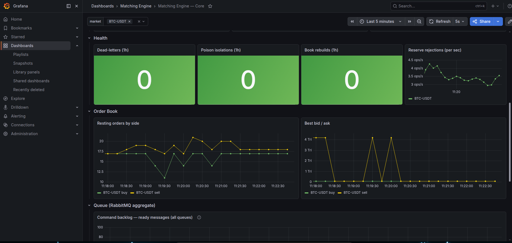
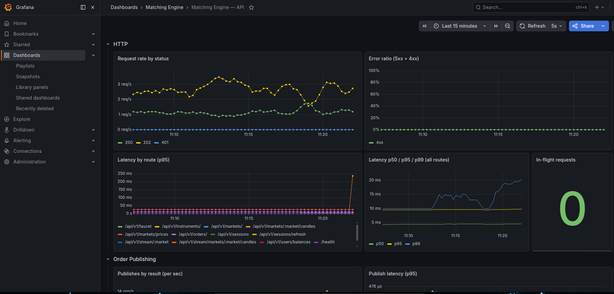
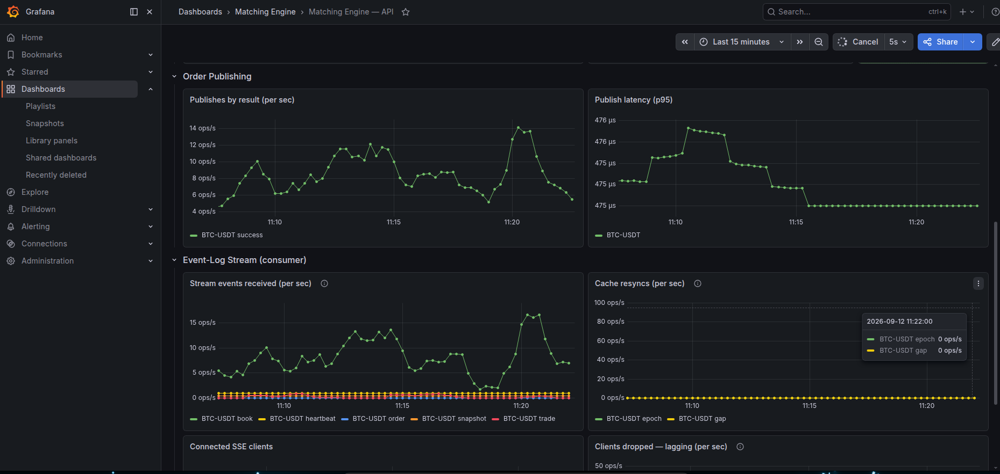
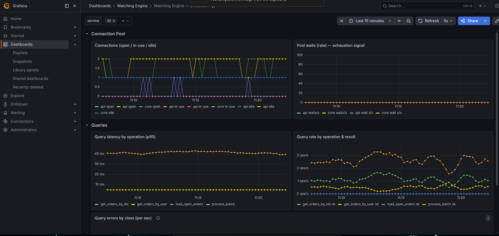

# Observability — Metrics Reference

This documents every metric the system exposes today, what it answers, its type, and its labels.
It reflects what is **implemented and live**, not a plan. Custom metrics are emitted through
`common/pkg/observability` (`PrometheusMetrics` + `PrometheusServer`); each service also exposes Go
runtime/process metrics, and RabbitMQ exposes its own.

---

## Scrape targets

| Target | Endpoint | What it serves |
|--------|----------|----------------|
| **api** | `:9091/metrics` (`METRICS_PORT`) | `me_api_*`, `me_db_*` (`service="api"`), `go_*`, `process_*` |
| **core** | `:9092/metrics` (`METRICS_PORT`) | `me_core_*`, `me_db_*` (`service="core"`), `go_*`, `process_*` |
| **rabbitmq** | `:15692/metrics` | `rabbitmq_*` (queue depth / broker health) |

Prometheus scrapes all of the above (`infra/local-deploy/prometheus/prometheus.yml`). Grafana dashboards:
**`me-api`**, **`me-core`**, **`me-db`** (`infra/local-deploy/grafana/dashboards/`).

---

## Dashboards

Three dashboards are provisioned from `infra/local-deploy/grafana/dashboards/`. Note that
`make stack-up` brings up **only Postgres and RabbitMQ** — Grafana and Prometheus live in the full
compose file:

```sh
docker compose -f infra/local-deploy/docker-compose.yml up -d prometheus grafana
```

Grafana is then on **http://localhost:10000** (Prometheus on `:9090`). The captures below are from a
live local run under load, so they double as a reference for what "healthy" looks like.

> The captures predate the dead-letter and circuit-breaker panels added to `me-core`
> (**Dead-letters by reason**, **DLQ publish failures**, **Paused markets**, **Dead-letter queue
> depth**). Everything else matches; re-capture `core_1`/`core_2` to bring them level.

### `me-core` — Matching Engine — Core

Scoped by a **`market`** template variable (top left), so every panel is one market at a time.



*Throughput* — `orders_received` against `trades`, and the stacked outcome mix
(`cancelled`/`filled`/`open`/`partially_filled`/`rejected`) that shows at a glance whether orders are
resting, crossing, or being turned away. *Latency & Batching* — the `batch_duration` p50/p95/p99 SLI,
batch size, and batch outcomes (`committed`/`poison_isolated`/`transient_fail`).



*Health* — the resilience counters, all expected to sit at **0**; any of them moving is the signal to
investigate. *Order Book* — resting depth per side and best bid/ask. *Queue* — the RabbitMQ command
backlog, which answers "is core keeping up?".

### `me-api` — Matching Engine — API



*HTTP* — request rate by status, error ratio, and latency both per route (p95) and aggregate
(p50/p95/p99), plus in-flight requests as the saturation signal. Latency is keyed on the **route
template**, so `/api/v1/markets/:market/candles` is one series rather than one per market.



*Order Publishing* — the API→broker hop: publishes by result and p95 latency. *Event-Log Stream
(consumer)* — events received by type, **cache resyncs** (the stream-correctness SLI, expected flat at
0), connected SSE clients, and clients dropped for lagging.

### `me-db` — Matching Engine — Database

Scoped by a **`service`** variable (`api` / `core` / All), since both processes embed the repository
and pool.



*Connection Pool* — open/in-use/idle per service, and pool waits as the exhaustion signal. *Queries* —
p95 latency and rate per `operation`, plus errors broken down by SQLSTATE `class`.

---

## Naming conventions

- Namespace **`me`** (matching engine), subsystem per module: **`api`**, **`db`**, **`core`**.
  Full name = `me_<subsystem>_<name>_<unit>`, e.g. `me_core_batch_duration_seconds`.
- Counters end in `_total`; histograms carry a unit suffix (`_seconds`); gauges are point-in-time.
- **Labels are bounded sets only** — never `order_id`, `user_id`, raw URL path, prices, or timestamps
  (see [Label cardinality](#label-cardinality)).

---

## `api` — subsystem `me_api_*`

Recorded by the HTTP `AccessLog` middleware and the order publisher (`api/internal/metrics`).

| Metric | Type | Labels | Answers |
|--------|------|--------|---------|
| `me_api_http_requests_total` | counter | `method, route, status` | Request volume and HTTP error rate |
| `me_api_http_request_duration_seconds` | histogram | `method, route, status` | Latency distribution (p50/p95/p99) per endpoint |
| `me_api_http_requests_in_flight` | gauge | — | In-flight requests right now (saturation) |
| `me_api_order_publish_total` | counter | `market, result` | Did the order reach RabbitMQ? `result` = `success` \| `error` |
| `me_api_order_publish_duration_seconds` | histogram | `market` | Latency of the API→broker publish hop |
| `me_api_stream_events_received_total` | counter | `market, type` | Event-log events consumed from the exchange (`type` = `trade`/`book`/`order`/`snapshot`/`heartbeat`) |
| `me_api_stream_resyncs_total` | counter | `market, reason` | **Stream correctness SLI** — a market cache fell out of sync; `reason` = `gap` \| `epoch`. Should be ~0 |
| `me_api_stream_public_clients` | gauge | `market` | Connected public SSE clients per market |
| `me_api_stream_private_users` | gauge | — | Distinct users with an active private binding on this instance (binding-churn signal) |
| `me_api_stream_clients_dropped_total` | counter | `kind` | SSE clients dropped for lagging; `kind` = `public` \| `private` |

`route` is the **matched route template** (`/api/v1/orders/:id`), never the concrete path. Requests
that 404/405 are not counted (no bounded template).

> ⚠️ **`stream_events_received` vs core's `stream_events_published`:** they reconcile only **per API
> instance**. With N instances, each receives every public event via fan-out, so the *sum* across
> instances is ≈ N× published — compare a single instance's `received` to core's `published` to spot loss.

---

## `db` — subsystem `me_db_*`

Emitted by **both** the `api` and `core` processes (the repository + `sql.DB` pool run embedded in
each), so every series carries a **`service`** label (`"api"` \| `"core"`). There is no standalone
`db` process. Pool stats come from a **scrape-time collector** reading `sql.DB.Stats()`
(`db/pkg/metrics`).

| Metric | Type | Labels | Answers |
|--------|------|--------|---------|
| `me_db_pool_connections_open` | gauge | `service` | Open connections (in use + idle) |
| `me_db_pool_connections_in_use` | gauge | `service` | Connections currently serving a query |
| `me_db_pool_connections_idle` | gauge | `service` | Idle headroom |
| `me_db_pool_wait_count_total` | counter | `service` | Times a caller blocked waiting for a connection (pool exhaustion) |
| `me_db_pool_wait_duration_seconds_total` | counter | `service` | Cumulative time spent blocked waiting for a connection |
| `me_db_query_duration_seconds` | histogram | `service, operation, result` | Per-operation query latency. `result` = `ok` \| `error` |
| `me_db_query_errors_total` | counter | `service, operation, class` | Query errors. `class` = SQLSTATE class (`22`, `23`, `40`, `08`, …) or `no_rows` / `context` / `other` |

**Instrumented `operation`s** (`OrderRepository` only): `get_order`, `get_orders_by_user`,
`get_orders_by_ids`, `load_open_orders`, `process_batch`. Other repositories (user/market/instrument)
are not yet instrumented.

> A domain-translated "not found" surfaces as `result=error, class=other` (the repository converts
> `sql.ErrNoRows` to a sentinel before the metric sees it). Filter `operation=get_order` for a clean
> error view, or treat `class=no_rows` as non-error where it does appear.

---

## `core` — subsystem `me_core_*`

The matching engine. One processor per market; per-order counters use pre-bound handles so the hot
path is allocation-free (`core/internal/metrics`). Metric values are derived from the committed
`BatchResult` and a read-only book snapshot — the order book itself stays pure.

| Metric | Type | Labels | Answers |
|--------|------|--------|---------|
| `me_core_orders_received_total` | counter | `market` | Throughput into the engine (orders accepted off the queue) |
| `me_core_orders_processed_total` | counter | `market, outcome` | Outcome mix (see values below) |
| `me_core_trades_total` | counter | `market` | Executed trades (fills) — match rate |
| `me_core_batch_size` | histogram | `market` | Orders per committed micro-batch (batching efficiency) |
| `me_core_batch_duration_seconds` | histogram | `market` | **Core latency SLI** — match + commit time per batch |
| `me_core_batches_total` | counter | `market, result` | Batch outcomes (see values below) |
| `me_core_reserve_rejections_total` | counter | `market` | Orders rejected at balance reservation (insufficient funds) |
| `me_core_poison_isolations_total` | counter | `market` | Batches that fell into per-order isolation |
| `me_core_dead_letters_total` | counter | `market`, `reason` | Commands parked in the dead-letter queue — **alert on any increase**. `reason` is one of `malformed`, `invalid`, `unknown_type`, `poison` |
| `me_core_dlq_publish_failures_total` | counter | `market` | Commands dropped because the parking-lot publish itself failed — the only path that loses an order outright, **alert on any increase** |
| `me_core_market_paused` | gauge | `market` | 1 while an operator has halted the market with `cli market pause`. Pair with the command backlog panel — a paused market shows a climbing queue by design |
| `me_core_book_rebuilds_total` | counter | `market` | Book hydrations triggered by a failed batch — **alert on rate** |
| `me_core_book_orders` | gauge | `market, side` | Resting order count per side (book depth) |
| `me_core_book_best_price` | gauge | `market, side` | Best bid / best ask (0 when that side is empty) |
| `me_core_stream_events_published_total` | counter | `market, type` | Event-log events handed to the publisher (`type` = `trade`/`book`/`order`/`snapshot`/`heartbeat`) |
| `me_core_stream_events_dropped_total` | counter | `market` | Events dropped on a full publisher buffer — **forces consumers to re-snapshot; alert on rate** |
| `me_core_stream_publish_errors_total` | counter | — | Broker publish failures after the publisher's reopen-retry (global — no market context in the publish goroutine) |

- `outcome` ∈ `open` · `filled` · `partially_filled` · `cancelled` · `rejected`
- `result` ∈ `committed` · `transient_fail` · `poison_isolated`
- `side` ∈ `buy` · `sell`

`batch_*`, `reserve_rejections`, and the resilience counters live under `core` (the matcher owns the
batch loop) even though `ProcessBatch` physically runs in the repo — they are matching-engine SLIs.
The generic SQL view is `me_db_query_*`.

---

## Runtime & process (all services)

Each service registry preloads the standard collectors, so `/metrics` also exposes:

- `go_*` — goroutines, GC pauses, heap/alloc, threads (`collectors.NewGoCollector`).
- `process_*` — CPU seconds, resident/virtual memory, open FDs, start time (`collectors.NewProcessCollector`).

Useful for spotting goroutine/FD leaks or GC pressure under load.

---

## RabbitMQ (broker)

Scraped from the broker's own Prometheus plugin (`:15692`) — **not** re-instrumented in core. Key
series for this system:

- `rabbitmq_queue_messages_ready` — command backlog (consumer lag). The engine's "is core keeping
  up?" signal.
- `rabbitmq_queue_messages_unacked`, `rabbitmq_connections`, `rabbitmq_channels`, node memory/health.

> The broker runs with `prometheus.return_per_object_metrics = true`
> (`infra/local-deploy/rabbitmq/rabbitmq.conf`), so these carry a **`queue`** label and the backlog can
> be read per market. That is what makes a paused market legible — its queue climbs while the others
> stay flat — and it is why the dead-letter queues are separable as `queue=~"me\.dlq\..*"`.
>
> The cost is one series per queue. This deployment has two per market (the command queue and its
> parking lot) plus the ephemeral `amq.gen-*` subscriber queues, so it is negligible here; on a broker
> with thousands of queues, turn it back off and lose the per-market breakdown.

---

## Histogram buckets

| Histogram | Buckets (seconds, unless noted) |
|-----------|---------------------------------|
| `me_api_http_request_duration_seconds` | `0.001, 0.005, 0.01, 0.025, 0.05, 0.1, 0.25, 0.5, 1, 2.5` |
| `me_api_order_publish_duration_seconds` | `0.0005, 0.001, 0.0025, 0.005, 0.01, 0.025, 0.05, 0.1` |
| `me_db_query_duration_seconds` | `0.0005, 0.001, 0.0025, 0.005, 0.01, 0.025, 0.05, 0.1, 0.25` |
| `me_core_batch_duration_seconds` | `0.0005, 0.001, 0.0025, 0.005, 0.01, 0.025, 0.05, 0.1` |
| `me_core_batch_size` | `1, 2, 4, 8, 16, 32, 64, 96, 128` (count, not seconds) |

The batch-size buckets run to **128** to match `maxBatchSize`, so `histogram_quantile` reads a full
batch accurately instead of saturating below the cap.

---

## Label cardinality

| Label | Domain | Bound |
|-------|--------|-------|
| `service` | `api`, `core` | 2 |
| `market` | active markets | ~tens |
| `side` | `buy`, `sell` | 2 |
| `outcome` | open/filled/partially_filled/cancelled/rejected | 5 |
| `result` | success/error, or committed/transient_fail/poison_isolated | ≤3 |
| `operation` | logical query names | small fixed set |
| `class` | SQLSTATE class + sentinels | small fixed set |
| `method` | HTTP verbs | ~5 |
| `route` | route **templates** | bounded by router |
| `status` | HTTP status codes | small set |

**Never used as labels:** `order_id`, `user_id`, raw URL path, prices, timestamps, any unbounded id.

---

## Not yet emitted — durable outbox (separate future concern)

The **live event-log** fan-out (`me.events`, `docs/event-log.md`) is now built and instrumented — see
`me_core_stream_*` and `me_api_stream_*` above. It is **ephemeral and best-effort** by design: drops
are visible (`stream_events_dropped_total`) and consumers re-snapshot, so there is no consistency-lag
to measure.

The metrics below belong to a **separate, not-yet-built** concern: a **durable transactional outbox**
(events written inside the match tx, drained by a publisher) for an analytics/settlement pipeline that
must never miss an event. Only that design makes a consistency-lag SLI meaningful. Pre-designed here so
the instrumentation lands with it.

| Metric (planned) | Type | Labels | Answers |
|------------------|------|--------|---------|
| `me_core_outbox_backlog_rows` | gauge | `market` | Committed-but-unpublished events (publisher falling behind) |
| `me_core_outbox_oldest_unpublished_age_seconds` | gauge | `market` | **Consistency-lag SLI** — how stale the outbox is vs the ledger |
| `me_core_outbox_publish_errors_total` | counter | `market` | Outbox publish failure rate |
