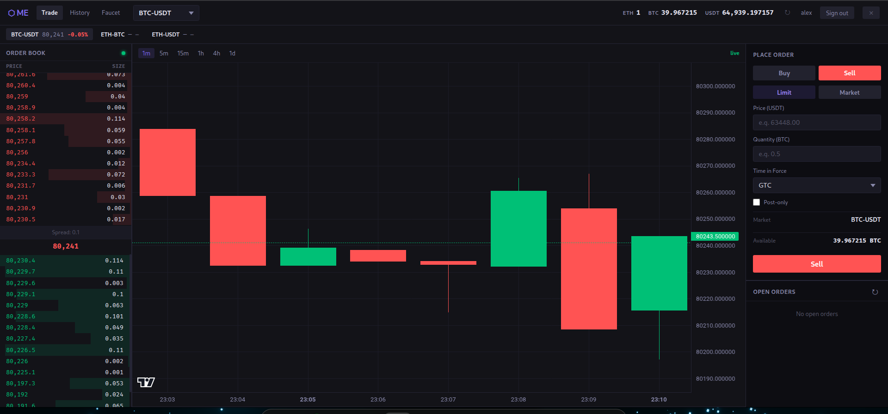
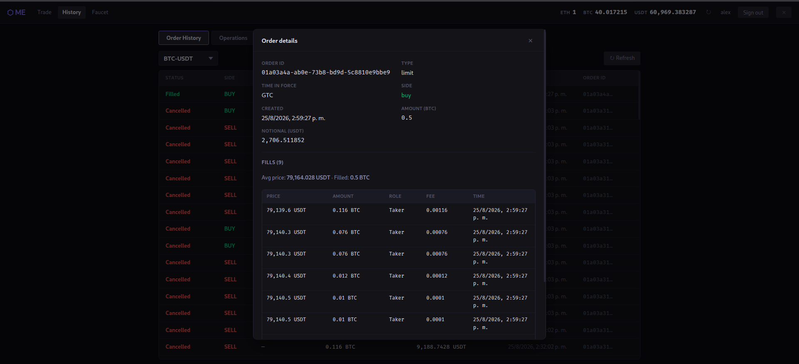

# ui

React web frontend for visualizing the matching engine's order book and candle charts live.

## Screenshots

**Trading view** — order book, live price ticker, candle chart, and order entry:



**Order history** — click any order for a fill-by-fill breakdown with computed average price:



## Routes

- `/` — trading view (order book, chart, order entry)
- `/history` — order history and account operations (deposits/withdrawals/freezes), tabbed
- `/faucet` — sandbox faucet to credit test balances

`/history` and `/faucet` require a signed-in session; guests are prompted to sign in.

## Run locally

Requires the `api` (and `core`) to already be running — see the root [README](../README.md#local-development).

```sh
npm install
npm run dev
```

Then open http://localhost:5173.

## Run via Docker

From the repo root:

```sh
docker compose -f infra/local-deploy/docker-compose.yml up -d ui
```
